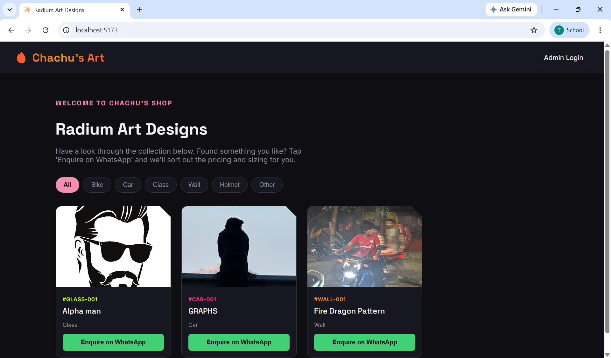
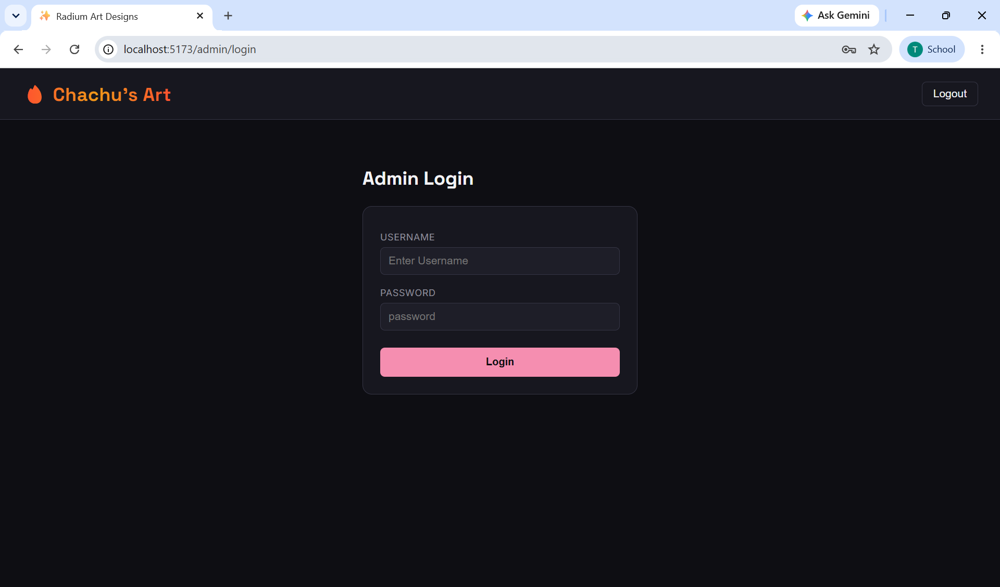
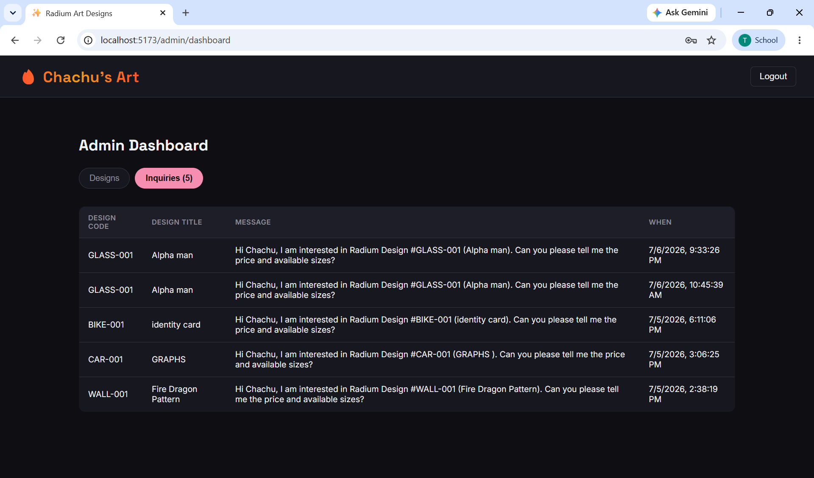
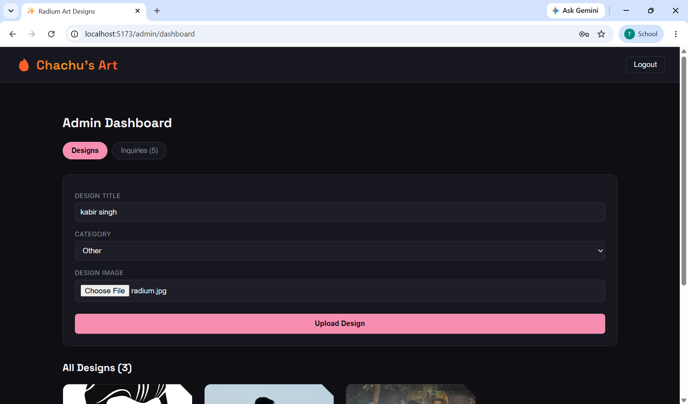

# Chachu's Art — Radium Sticker Catalog

A website built for my uncle's (chachu's) shop, which makes radium (glow-in-the-dark) 
sticker designs for bikes, cars, helmets, glass, and walls.

Customers can browse his designs online, and if they like one, they tap a button 
to enquire directly on WhatsApp — no need to visit the shop just to ask about a design.

🔗 **GitHub:** https://github.com/itanupriya/Chachu-s-Art

## What it does

- Customers browse designs, sorted by category (Bike, Car, Glass, Wall, Helmet, Other)
- Every design gets its own unique code automatically, like `BIKE-001`
- Tapping "Enquire on WhatsApp" opens WhatsApp with a message already filled in, 
  mentioning the exact design code — so chachu knows exactly which design the 
  customer means
- Every enquiry is also saved in the database, as a backup in case the customer 
  doesn't send the WhatsApp message
- Chachu has his own admin login where he can upload new designs and see every 
  enquiry that's come in

## Built with

- **MongoDB** — stores the designs and enquiries
- **Express** — the backend API
- **React** (with Vite) — the website itself
- **Node.js** — runs the backend
- **JWT** — keeps the admin login secure
- **Multer** — handles uploading design images

## ScreenShots in working mode of the Art gallery 

## Screenshots

### Gallery


### Admin Login


### Inquiries Dashboard


### Upload Designs


### 1. Backend

```bash
cd backend
npm install
cp .env.example .env
```
Open `.env` and fill in your own MongoDB connection string, a secret key, and 
an admin username/password. Then run:
```bash
npm run seed:admin
npm run dev
```
This starts the backend at `http://localhost:5000`

### 2. Frontend

```bash
cd frontend
npm install
cp .env.example .env
```
Open `.env` and set your WhatsApp number. Then run:
```bash
npm run dev
```
This starts the website at `http://localhost:5173`

### 3. Try it

- Open `http://localhost:5173` to see the shop's gallery
- Go to `http://localhost:5173/admin/login` to log in as admin and upload designs